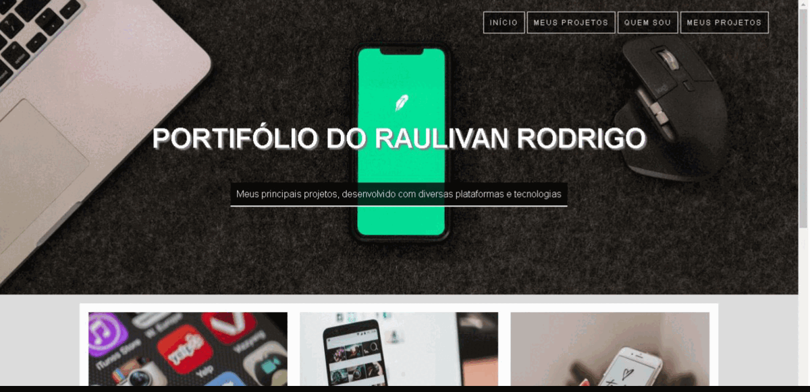
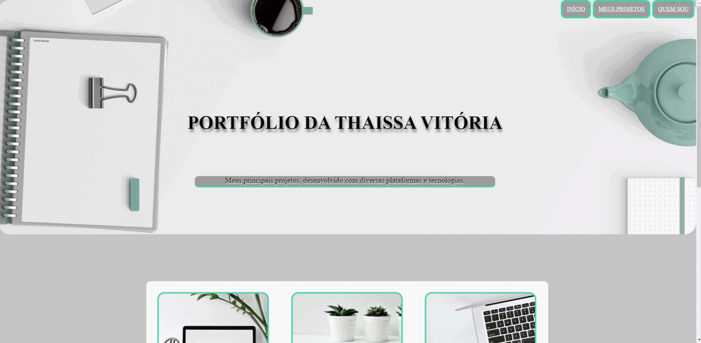
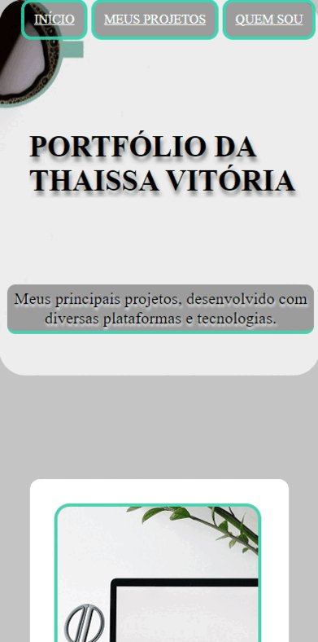

## Problema Proposto

O objetivo desta atividade era reproduzir um site passado pelo docente, a atividade foi aplicada com o intuito de treinar desenvolvimento de códigos na parte HTML e CSS, além de entender e aplicar um pouco de Responsividade.
O site era a página inicial de um Portifólio pessoal, foi pedido que se reproduzisse o mais fielmente possível o modelo em questão de posicionamento, as imagens e cores poderiam ser de escolha pessoal. Segue o site modelo:

Ele deveria ser responsivo apenas para celulares.

## Meu Portifólio
Seguindo o exemplo, personalizando de acordo com a idéia que tenho para um possível futuro portifólio pessoal, desenvolvi o seguinte site:

Aplicando a responsividade para celulares, temos o site da seguinte maneira:

